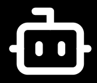

<div align="center">
  
  
  <h1>DocBot</h1>
  
  <p>
    <strong>AI-powered chatbot platform for your documents.</strong><br />
    Upload your files, embed a chatbot on any website — in minutes.
  </p>

  <p>
    <a href="https://docbot-beige.vercel.app">🌐 Live Demo</a>
    ·
    <a href="https://docbot-beige.vercel.app/#demo">💬 Try It Free</a>
    ·
    <a href="https://github.com/123khateeb/docbot/issues">🐛 Report Bug</a>
    ·
    <a href="https://github.com/123khateeb/docbot/issues">✨ Request Feature</a>
  </p>

  <p>
    
    
    
    
    
    
  </p>

  
</div>

---

## 📌 Overview

**DocBot** is an open-source SaaS platform that lets you turn any document into an AI-powered chatbot — and embed it on any website with a single line of code.

Built with **RAG (Retrieval Augmented Generation)** architecture, DocBot answers questions strictly from your uploaded content — no hallucinations, no outside knowledge.

> **Try it live:** [docbot-beige.vercel.app](https://docbot-beige.vercel.app)

---

## ✨ Features

- 📁 **Multi-format file support** — Upload PDF, DOCX, and TXT files
- 🤖 **RAG-powered AI** — Answers come strictly from your documents
- 🎨 **Widget customization** — Change name, color, logo, welcome message
- 🔑 **BYOK (Bring Your Own Key)** — Use your own API key from any provider
- 🌐 **Multi-provider AI** — Gemini, Groq, OpenAI, Anthropic
- 📊 **Analytics dashboard** — Track every conversation
- 🔒 **Secure** — Row Level Security, per-user data isolation
- 📱 **Fully responsive** — Works on mobile and desktop
- ⚡ **One-line embed** — Single `<script>` tag for any website
- 🆓 **Free to self-host** — No vendor lock-in

---

## 🚀 Quick Start

### Prerequisites

- Node.js 18+
- [Supabase](https://supabase.com) account (free)
- [Google AI Studio](https://aistudio.google.com) API key (free)

### Installation

```bash
# Clone the repository
git clone https://github.com/123khateeb/docbot.git
cd docbot

# Install dependencies
npm install

# Set up environment variables
cp .env.example .env.local
```

### Environment Variables

Create a `.env.local` file in the root directory:

```env
NEXT_PUBLIC_SUPABASE_URL=your_supabase_project_url
NEXT_PUBLIC_SUPABASE_ANON_KEY=your_supabase_anon_key
SUPABASE_SERVICE_ROLE_KEY=your_supabase_service_role_key
GEMINI_API_KEY=your_gemini_api_key
NEXT_PUBLIC_APP_URL=http://localhost:3000
```

### Database Setup

Run these SQL queries in your Supabase SQL Editor:

```sql
-- Enable pgvector
create extension if not exists vector;

-- Create tables
create table bots (
  id uuid primary key default gen_random_uuid(),
  user_id uuid references auth.users(id) on delete cascade,
  name text,
  bot_name text default 'DocBot',
  welcome_message text default 'Hello! How can I help you today? 👋',
  color text default '#000000',
  fallback_message text,
  logo_url text,
  ai_provider text default 'gemini',
  ai_api_key text,
  is_active boolean default true,
  created_at timestamp with time zone default now()
);

create table documents (
  id uuid primary key default gen_random_uuid(),
  bot_id uuid references bots(id) on delete cascade,
  file_name text not null,
  file_path text not null,
  file_type text not null,
  status text default 'processing',
  created_at timestamp with time zone default now()
);

create table embeddings (
  id uuid primary key default gen_random_uuid(),
  bot_id uuid references bots(id) on delete cascade,
  doc_id uuid references documents(id) on delete cascade,
  content text not null,
  embedding vector(3072),
  created_at timestamp with time zone default now()
);

create table conversations (
  id uuid primary key default gen_random_uuid(),
  bot_id uuid references bots(id) on delete cascade,
  session_id text,
  question text not null,
  answer text not null,
  was_helpful boolean,
  created_at timestamp with time zone default now()
);

-- Vector similarity search function
create or replace function match_embeddings(
  query_embedding vector(3072),
  match_bot_id uuid,
  match_count int default 10
)
returns table (id uuid, content text, similarity float)
language plpgsql
as $$
begin
  return query
  select embeddings.id, embeddings.content,
    1 - (embeddings.embedding <=> query_embedding) as similarity
  from embeddings
  where embeddings.bot_id = match_bot_id
  order by embeddings.embedding <=> query_embedding
  limit match_count;
end;
$$;
```

### Run Development Server

```bash
npm run dev
```

Open [http://localhost:3000](http://localhost:3000) in your browser.

---

## 🏗️ Architecture

```
┌─────────────────────────────────────────────────────┐
│                    DocBot Platform                   │
├──────────────┬──────────────────┬───────────────────┤
│   Marketing  │    Dashboard     │   Chatbot Widget  │
│   Landing    │  Files/Analytics │   (widget.js)     │
│   Page       │  Bot Settings    │   Any Website     │
└──────┬───────┴────────┬─────────┴────────┬──────────┘
       │                │                  │
       ▼                ▼                  ▼
┌─────────────────────────────────────────────────────┐
│              Next.js API Routes                      │
│   /api/upload  /api/chat  /api/bot/settings         │
│   /api/guest/create  /api/guest/cleanup             │
└──────────────────┬──────────────────────────────────┘
                   │
       ┌───────────┴───────────┐
       ▼                       ▼
┌─────────────┐         ┌─────────────┐
│  Supabase   │         │  AI Provider│
│  PostgreSQL │         │  Gemini     │
│  pgvector   │         │  Groq       │
│  Storage    │         │  OpenAI     │
│  Auth       │         │  Anthropic  │
└─────────────┘         └─────────────┘
```

### RAG Pipeline

```
File Upload
    ↓
Text Extraction (unpdf / mammoth)
    ↓
Chunking (200 words/chunk)
    ↓
Embedding Generation (gemini-embedding-001)
    ↓
Vector Storage (pgvector)

User Question
    ↓
Question Embedding
    ↓
Similarity Search (cosine distance)
    ↓
Top 10 Relevant Chunks
    ↓
AI Answer Generation
    ↓
Response to User
```

---

## 🛠️ Tech Stack

| Category | Technology |
|----------|-----------|
| **Framework** | Next.js 16 (App Router) |
| **Language** | TypeScript |
| **Styling** | Tailwind CSS v4 |
| **Components** | shadcn/ui (Nova preset) |
| **Database** | Supabase (PostgreSQL) |
| **Vector DB** | pgvector (via Supabase) |
| **Auth** | Supabase Auth |
| **Storage** | Supabase Storage |
| **AI — Chat** | Gemini 2.5 Flash / Groq / OpenAI / Anthropic |
| **AI — Embeddings** | gemini-embedding-001 (3072 dims) |
| **Deployment** | Vercel |

---

## 📁 Project Structure

```
docbot/
├── app/
│   ├── (auth)/              # Login & Signup pages
│   ├── (marketing)/         # Landing page
│   ├── dashboard/           # Protected dashboard
│   │   ├── files/           # File management
│   │   ├── chatbot/         # Bot settings & embed code
│   │   ├── analytics/       # Conversation analytics
│   │   └── settings/        # AI provider & API key (BYOK)
│   ├── api/
│   │   ├── chat/            # Chat endpoint (RAG)
│   │   ├── upload/          # File upload & processing
│   │   ├── bot/settings/    # Bot settings for widget
│   │   └── guest/           # Guest session management
│   └── auth/callback/       # Supabase auth callback
├── components/
│   ├── dashboard/           # Dashboard components
│   ├── marketing/           # Landing page components
│   └── ui/                  # shadcn/ui components
├── lib/
│   ├── supabase/            # Supabase client (browser + server)
│   ├── gemini.ts            # Multi-provider AI (Gemini/Groq/OpenAI/Anthropic)
│   ├── rag.ts               # RAG pipeline (processFile + searchSimilarChunks)
│   └── file-parser.ts       # PDF/DOCX/TXT text extraction
└── public/
    └── widget.js            # Embeddable chatbot widget
```

---

## 🔑 Supported AI Providers

| Provider | Models | Free Tier |
|----------|--------|-----------|
| **Google Gemini** | gemini-2.5-flash | ✅ 250 req/day |
| **Groq** | llama-3.3-70b, mixtral-8x7b | ✅ Generous |
| **OpenAI** | gpt-4o, gpt-4o-mini | ❌ Paid |
| **Anthropic** | claude-3-5-sonnet, claude-3-haiku | ❌ Paid |

---

## 📦 Embed Your Chatbot

Add this single line before the closing `</body>` tag on any website:

```html
<script 
  src="https://docbot-beige.vercel.app/widget.js" 
  data-bot-id="YOUR_BOT_ID">
</script>
```

That's it. Your AI chatbot is live. ✅

---

## 🤝 Contributing

Contributions are welcome! Please feel free to submit a Pull Request.

1. Fork the project
2. Create your feature branch (`git checkout -b feature/AmazingFeature`)
3. Commit your changes (`git commit -m 'feat: add AmazingFeature'`)
4. Push to the branch (`git push origin feature/AmazingFeature`)
5. Open a Pull Request

---

## 📄 License

Distributed under the MIT License. See `LICENSE` for more information.

---

## 👨‍💻 Author

**Khateeb Ahmad** — Frontend Engineer

[](https://linkedin.com/in/khateeb-ahmad-705b02396)
[](https://github.com/123khateeb)

---

<div align="center">
  <p>If you found this project helpful, please consider giving it a ⭐</p>
  <p>Built with ❤️ by <a href="https://github.com/123khateeb">Khateeb Ahmad</a></p>
</div>